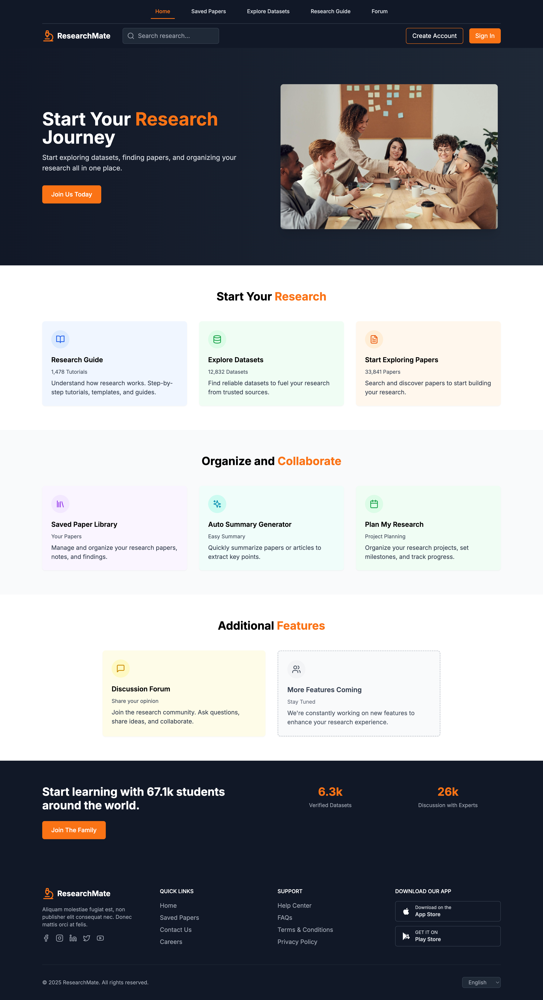

# 📚 Research Mate Dashboard (React + Vite + Tailwind + AI Tools)

A smart, lightweight research assistant dashboard built using **React**, **Vite**, **TypeScript**, and **Tailwind CSS**. The dashboard integrates:

* 🧠 AI-powered paper summarization
* 📝 Citation management tools
* 💬 An integrated chatbot for quick research queries

This project focuses entirely on the **frontend**, designed for interaction with AI/Node.js APIs.

---

## 📸 Demo



---

## 🔧 Features

* 📄 AI-based research paper summarization UI
* 🔍 Keyword extraction & highlight-ready summaries
* 📝 Citation manager interface (APA/MLA/IEEE-ready)
* 💬 Built‑in chatbot panel for quick Q&A
* ⚡ Vite-powered React app (fast, lightweight)
* 🎨 Tailwind CSS for responsive UI
* ♻️ Modular component-based architecture

---

## 🗂️ Folder Structure

```
ResearchMate-Dashboard/
├── src/                   # React source code
│   ├── components/        # UI components
│   ├── pages/             # Page views (optional based on your structure)
│   ├── hooks/             # Custom hooks
│   ├── utils/             # Helper functions (AI requests, parsing)
│   ├── App.tsx
│   └── main.tsx
├── index.html             # App entry
├── vite.config.ts         # Vite configuration
├── tailwind.config.js     # Tailwind setup
├── tsconfig.json          # TypeScript config
├── package.json
└── README.md
```

---

## 🚀 Getting Started

### 1️⃣ Install dependencies

```bash
npm install
# or
pnpm install
# or
yarn install
```

### 2️⃣ Run development server

```bash
npm run dev
```

App runs at:

```
http://localhost:5173
```

---

## 🧠 AI Integration (Frontend Overview)

This frontend was designed to connect with:

* **Node.js API endpoints** for AI summarization
* **OpenAI or similar LLM services** via HTTP calls
* **Citation management micro‑API** for formatting outputs

Request structure:

```ts
await fetch("/api/summarize", {
  method: "POST",
  headers: { "Content-Type": "application/json" },
  body: JSON.stringify({ text: paperContent }),
});
```

---

## 📦 Scripts

```json
npm run dev      # start dev server
npm run build    # production build
npm run preview  # preview production
```

---

## 🔧 Tech Stack

* **React + TypeScript**
* **Vite**
* **Tailwind CSS**
* **AI API integrations (backend not included here)**

---

## 🙌 Acknowledgements

* React
* Vite
* Tailwind CSS
* OpenAI & LLM tools
